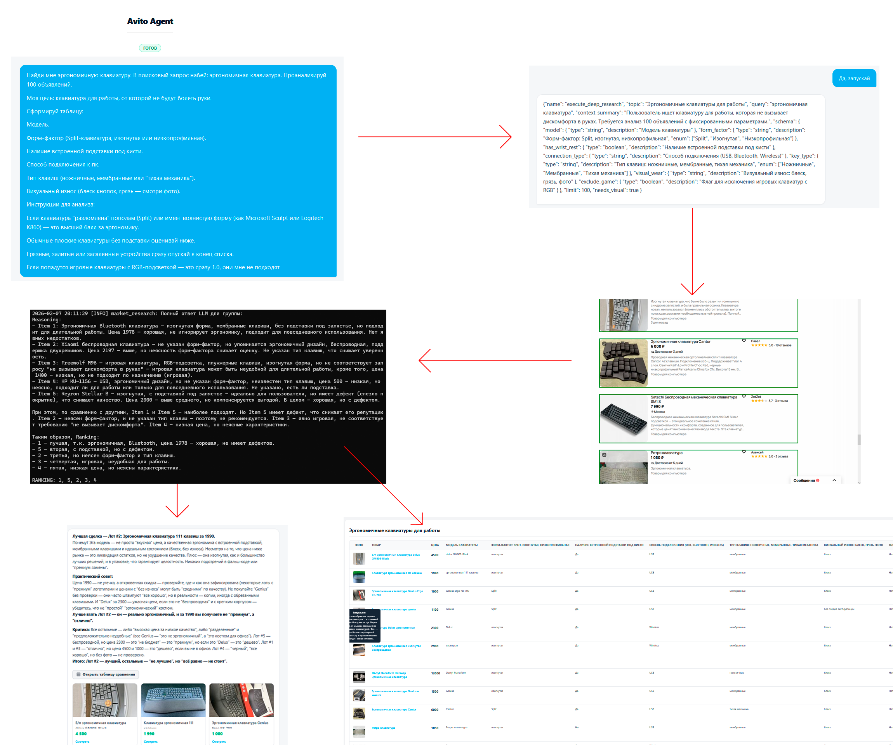

# Avito Agent

Avito Agent - это ИИ агент для поиска, анализа и структурирования товаров на Avito.

* Ищет товары
* Парсит объявления, сохраняет в базу данных
* Сравнивает разные предложения между собой
* Учитывает пожелания пользователя
* Изучает состояние на фотографии
* Выбирает лучшие предложения
* 100% локальный запуск

## Ключевые возможности 

### ИИ агент

Главный элемент системы - цикл сообщений пользователя и модели в чате. 
В ходе диалога LLM сама решает когда и какой тип поиска использовать. 

### Два режима поиска

**Quick search** - быстрый поиск для поверхностного изучения нескольких предложений. 
**Deep Research** - глубокое исследование с определением задачи, извлечением критериев, турнирным сравнением, генерацией отчета. 

#### Quick Search 

Нужен для быстрого обзора рынка. Загружает 10 объявлений. 

Поддерживает параметры:
query - поисковый запрос, будет вставлен в строку поиска авито
needs_visual - требуется ли обработка изображений. В случае если false, обрабатывается только текстовое описание. 

Результаты поиска принимаются от расширения, форматируются в строку. 
На основе: 
1. Результатов поиска 
2. Истории чата 
3. Отдельного "обзорного" промпта
генерируется сообщение с анализом этих первых результатов. 
Сообщение добавляется в основную историю чата. Сырые результаты поиска (лоты с авито) не добавляются в основную историю. 

Под обзорным сообщением размещаются карточки с превью картинки, ценой, названием, ссылкой на товар. Это позволяет пользователю сопоставлять слова ассистента с изображениями товаров и быстро перейти к ним. 

#### Deep Research

Глубокий анализ объявлений. Собирается большое количество объявлений (по умолчанию 50, но LLM может настраивать количество в параметрах инструмента). 
В сообщении пользователь описывает важные для себя критерии (например - объем памяти, цвет, вес, тип, состояние - какие-то объективные показатели). На этапе планирования Агент генерирует динамичную json схему с важными для пользователя показателями. 
Позже эта схема будет использоваться для структурирования объявлений. 
Кроме полей которые указывает агент, обязательно добавляются поля для описания изображения и поле с заметками. 

После сбора информации и структурирования ее, запускается этап турнира. 
> Изначально планировалось использовать фильтры по извлеченным полям. Но такой подход на практике работал плохо. В некоторых случаях результатов поиска было слишком мало, в некоторых случаях информация не указывалась. Поэтому было решено использовать более гибкий метод для сравнения объявлений друг с другом, вдохновленный системой elo. 

Метод Борда - https://en.wikipedia.org/wiki/Borda_count
Все лоты разбиваются на группы по 5 штук. Проводится 4 раунда сравнения (для 100 лотов это 100/5 * 4 = 80 сравнений по 5 лотов в каждом сравнении). В каждом раунде лоты перемешиваются. 
В каждом мини-матче сравнения LLM получает требования пользователя, извлеченные критерии. Требования пользователя передаются как параметр context_summary при вызове моделью инструмента глубокого поиска. 
LLM должна расставить товары от лучшего к худшему. 
За каждое место лот получает баллы. В конце вычисляется средний арифметический балл. 

После турнира система готовит финальный ответ. Генрируется обзор топ 5 лотов по результатам турнира. ИИ выделяет лучшее предложение, дает советы. 
5 карточек товаров также отображаются под сообщением. 

Фичи
* Опциональный анализ изображений 
* Защита от повторного сохранения объявления
* Защита от повторной обработки объявления 

### Интерфейс

Основное меню - чат с Агентом. 
Разделения на пользователей нет. 
Историю чатов можно посмотреть в выпадающей боковой панели, можно перейти к прошлым диалогам. 
Под сообщениями Агента могут отображаться карточки с товарами. 
Состояние Агента отображается в интерфейсе. 

#### Таблица с результатами

Имеется отдельная вкладка для детального просмотра результатов глубокого исследования. В ней находятся все спаршенные лоты, миниатюры картинок, ссылки, цены, извлеченные параметры по схеме. Поддерживается сортировка по всем параметрам таблицы. При наведении на картинку всплывает тултип с пояснениями LLM. 

### Браузерное расширение

"Руки и ноги" ИИ агента. Собирает информацию необходимую для ответа. 
Чтобы не изобретать отдельный парсер и обход антибота, решено использовать именно браузерное расширение для парсинга, так как оно работает от лица реального пользователя. 

Расширение работает в фоновом режиме, опрашивая бекенд о новых задачах. Когда расширение получает задачу, оно открывает новую вкладку с запросом, приступает к сбору данных. 

При сборе данных симулируется поведение человека:
* Плавный скролл, с рандомизированными шагами и задержками, который имитирует чтение человека
* Между парсингом отдельных карточек и скроллом встроены рандомные паузы

Расширение соблюдает лимит заданный агентом. Оно не будет собирать больше данных, чем было указано в задаче. Это позволяет закончить сбор данных быстрее, не требуя пролистывания всей страницы. 
Если требуется больше лотов, чем есть на одной странице, то расширение использует пагинацию для перехода на следующую. При переходе между страницами расширение не теряет прогресс благодаря local storage. 

Расширение на ходу сохраняет base64 изображений, чтобы избежать необходимости их повторной загрузки на бекенде. Изображения хешируются на бекенде, поэтому в хранилище они не дублируются. 

У расширения есть флаг регулирующий отображение - новая вкладка может открываться как активная (с переключением), а может открываться в фоне. 

В интерфейсе браузера обрабатываемое объявление подсвечивается. 

Обработка результатов от расширения происходит в фоне, не блокируя интерфейс. 

### Выбор модели

Система проектировалась вокруг модели "Qwen3-Vl-4B-Instruct", так как она:
* Поддерживает вызов инструментов
* Хорошо следует инструкциям
* Мультимодальная (изображения на вход)
* Помещается в 6гб vram (Q4_K_M, 8192 контекстное окно, mmproj-F16, llama-cpp server)
> Мое железо - gtx1660super, 6gb vram. Обработка 100 лотов занимает примерно час (извлечение характеристик + турнир 4 цикла (80 групп))

Вызовы инструментов модель осуществляет в формате Hermes: <tool_call>инструмент, параметры</tool_call>
> Такой формат рекомендуется в [документации](https://qwen.readthedocs.io/en/latest/framework/function_call.html)

## Стек 

* FastAPI с BackgroundTasks для LLM обработки
* SQLite + SQLAlchemy
* HTML + Vanilla JS + CSS (единственное что я знаю)
* Uvicorn web server
* Pydantic

# Запуск

## LLM модель

Для работы с LLM используется библиотека OpenAI. Развернуть модель можно при помощи Ollama, llama-cpp, любой движок с поддержкой OpenAI API. 

Адрес, название, ключи нужно указать в .env файле. (сейчас он закомичен, в нем все указано как было у меня для локальной модели)

## Бекенд сервер

Установить requirements, запустить `run_server.py`

## Браузерное расширение

Я использовал firefox. 

В firefox, меню отладка дополнений. Загрузить временное дополнение, указать manifest.json из папки extension. 
> about:debugging#/runtime/this-firefox